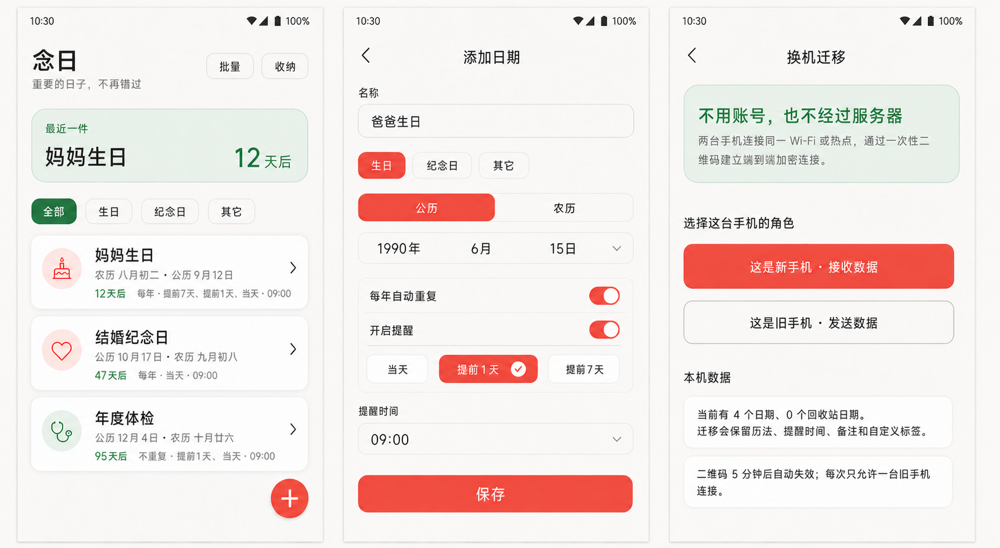
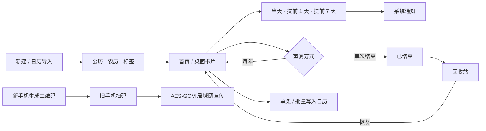

# 念日

[](https://github.com/lichengjie19/nianri-android/actions/workflows/android-ci.yml)
[](https://github.com/lichengjie19/nianri-android/releases/latest)

一个轻量的 Android 重要日期提醒应用。当前版本为 `1.1.2`，支持 Android 8.0（API 26）及以上。

## 下载

最新安装包见 [GitHub Releases](https://github.com/lichengjie19/nianri-android/releases/latest)。当前 APK 使用 Android 调试签名，适合测试安装，不用于正式应用商店发布。

## 已实现





日期只保存在本机；农历支持 1900—2100 年离线换算，换机无需账号或服务器。

首次安装会加入四条演示日期，便于查看滚动排序与已结束区域；均可编辑或删除。

## 数据来源与边界

- 农历编排规则参考现行 `GB/T 33661-2017《农历的编算和颁行》`。
- 离线换算使用 MIT 许可的 `lunar-java 1.7.7`，许可文本见 `third_party/lunar-java-LICENSE.txt`。
- 首版的“联网检查”只验证权威来源连接，不会下载或覆盖本地农历数据。正式的签名数据更新包尚未接入。

## 权限

- `POST_NOTIFICATIONS`：Android 13 及以上显示提醒。
- `SCHEDULE_EXACT_ALARM`：Android 12 上由用户开启“闹钟和提醒”特殊权限。
- `USE_EXACT_ALARM`：Android 13 及以上用于日历类核心准点提醒。
- `VIBRATE`：允许重要日期通知按通知频道设置震动。
- `FOREGROUND_SERVICE`：仅在提醒到点时启动短时送达服务，提交通知后立即停止。
- `RECEIVE_BOOT_COMPLETED`：开机后恢复提醒。
- `READ_CALENDAR`：用于用户主动从本机日历导入，或在批量添加时选择目标日历及去重。
- `WRITE_CALENDAR`：仅用于用户主动执行批量添加到本机日历。
- `CAMERA`：仅在旧手机主动扫描换机二维码时使用；画面不保存、不上传。
- `INTERNET`：用于两台手机间的局域网直传，以及用户主动执行权威来源检查。

## 构建

需要 JDK 17 和 Android SDK 36：

```bash
export LC_ALL=zh_CN.UTF-8
export JAVA_HOME=/Library/Java/JavaVirtualMachines/jdk-17.jdk/Contents/Home
./gradlew :app:assembleDebug
```

测试与静态检查：

```bash
./gradlew :app:testDebugUnitTest :app:lintDebug
```

调试 APK 输出到 `app/build/outputs/apk/debug/念日-v1.1.2.apk`。

## 参与贡献

请从功能或修复分支提交 Pull Request，具体见 [CONTRIBUTING.md](CONTRIBUTING.md)。安全问题请按 [SECURITY.md](SECURITY.md) 私密报告，不要在公开 Issue 中披露。
